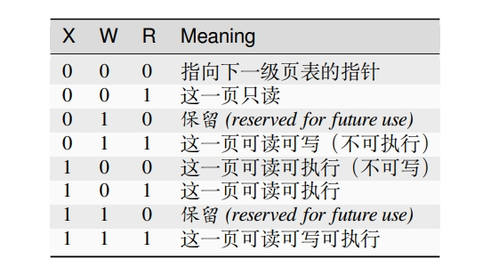
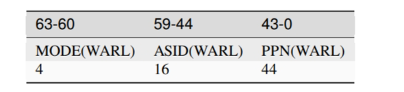

# 操作系统的物理内存管理
## 基础知识
1. 使用页表机制：RISCV:sv39 页大小：4k
2. 物理地址 (Physical Address) 有 56 位，虚拟地址 (Virtual Address) 有 39 位，虚拟地址`高位补齐`
3. 不论是物理地址还是虚拟地址，最后 12 位表示的是页内偏移。


### 页表项
1. 描述一个虚拟页号如何映射到物理页号
2. 有上述知，56-12=44，页表项需要44位来保存物理页号。
3. 页表项的结构：63-54位为保留位，53-10位为物理页号，9-0位为映射的状态信息位。

5. 状态位的介绍：
   1. RSW(2bit) 域留给操作系统使用，它会被硬件忽略。两位留给 S Mode 的应用程序，我们可以用来进行拓展。
   2. D：dirty，该页是否被写过
   3. A：accessed，该页是否被访问过
   4. G：global，该页是否是全局页
   5. U：user，该页是否属于用户态，若属于用户态，则为安全考虑，S Mode 的应用程序不能访问该页
   6. V：valid，该页是否有效，若无效，则说明该页还没有被分配物理内存，其它位无意义
   7. 剩下根据状态位三位(read、write、execute)RWX的取值不同，分别代表不同含义：

    

### 多级页表
sv39采用三级页表
1. 大小分别为：有 4KiB=4096 字节的页，大小为 2MiB=2^21 字节的大页，和大小为 1 GiB 的大大页。
2. 由于虚拟地址为39位，去除12位页内偏移，剩下27位，每一级页表的偏移9位，因此共计512G的虚拟内存地址空间
3. 每一级页表的大小：512bit/8*64=4kiB
   
### 页表基址
satp（Supervisor Address Translation and Protection，监管者地址转换和保护）的 S 模式控制状态寄存器(CSR)控制了分页系统。


1. MODE 域可以开启分页并选择分页模式，我们此处选择 Sv39 模式(1000)。
2. ASID 域是地址空间 ID，用于多进程的地址空间隔离，我们此处不使用多进程，因此 ASID 域为 0 即可，还可以用来降低上下文切换的开销。
3. PPN 域是页表基址，它指向了最高级地址的物理页号。`tag:，PPN 字段保存了根页表的物理地址，它以 4 KiB 的页面大小为单位。通常 M 模式的程序在第一次进入 S模式之前会把零写入 satp 以禁用分页，然后 S 模式的程序在初始化页表以后再次进行satp 寄存器的写操作。`
   
### TLB  (Translation Lookaside Buffer)
注意点：若PPN字段被修改，说明切换了映射方式，需要刷新TLB：`sfence.vma`指令，同样手动修改页表项后，也需要刷新TLB。

## 实验内容

# 物理内存管理
1. 探测可用的物理内存资源
2. 建立分页机制（划分页，建立页表）
3. 启动分页机制，让 CPU 的 MMU 把预先建立好的页表中的页表项读入到 TLB中
4. 根据页表项描述的虚拟页（Page）与物理页帧（Page Frame）的对应关系完成CPU对内存的读、写和执行操作

# 如何建立虚拟地址和物理地址之间的联系
1. 分配页表所在内存空间并初始化页表；
2. 设置好页基址寄存器（指向页表起始地址）；//计算物理页号覆盖到 satp 寄存器
3. 刷新 TLB。

# 练习 1
## 物理内存分配的过程：
1. 内存初始化：调用 `default_init` 函数初始化空闲内存块链表和空闲块的数量。
2. 初始化内存映射：调用 `default_init_memmap` 函数将一块新的空闲内存块加入内存映射中，将块首地址加入修改空闲内存块链表，增加空闲块数量。
3. 分配内存：调用 `default_alloc_pages` 函数来查找合适大小的空闲内存块，具体为查找到内存大于等于所需的块之后，若内存刚好相等则直接空闲内存块链表中取出，若内存大于则切成两个小块，把所需之外的另一小块重新加入链表当中，并且更新空闲块数量。
4. 释放内存：调用 `default_free_pages` 函数来释放指定的内存块，并检查前后是否有相邻的空闲内存块，存在则进行合并，之后重新加入空闲内存块链表当中，更新空闲块数量。

对 `default_init`，`default_init_memmap`，`default_alloc_pages` 和 `default_free_pages` 函数的详细分析：

1. `default_init(void)` 函数：
   - 作用：初始化内存分配器，将空闲内存块链表 `free_list` 设为空，并将 `nr_free` 初始化为 0。
   - 实现：函数使用 `list_init` 函数将 `free_list` 初始化为空链表，然后将 `nr_free` 设置为 0，表示当前没有可用的空闲内存块。

2. `default_init_memmap(struct Page *base, size_t n)` 函数：
   - 作用：初始化一个新的空闲内存块。
   - 实现：该函数首先检查参数 `n` 是否大于 0。然后，它遍历从 `base` 到 `base + n - 1` 的页面，对每个页面执行以下操作：
     - 检查页面是否已被保留（`assert(PageReserved(p))`），确保不会重复初始化已保留的页面。
     - 设置页面的 `flags` 和 `property` 字段都为 0，表示没有特殊属性。
     - 将页面的引用计数设置为 0，表示当前没有引用该页面。
     - 将页面添加到 `free_list` 中，如果 `free_list` 为空，就直接添加；否则，按照地址的顺序插入。
     - 最后，函数更新 `base` 页面的 `property` 为 `n`，表示这个内存块包含了 `n` 个页面，然后设置 `base` 页面的属性标志为标识它是一个空闲内存块。最后，它增加 `nr_free` 的值，表示有 `n` 个空闲页面可用。

3. `default_alloc_pages(size_t n)` 函数：
   - 作用：分配一块大小至少为 `n` 的内存块。
   - 实现：首先，函数检查 `n` 是否大于 0，如果不是，就直接返回 NULL，表示无法分配。然后，它遍历 `free_list` 链表，查找第一个具有 `property` 字段大于等于 `n` 的页面，表示该页面足够大以满足分配请求。如果找到符合条件的页面，就执行以下操作：
     - 选中这个页面，将其从 `free_list` 中移除。
     - 如果选中的页面的 `property` 大于 `n`，则将剩余部分创建为新的页面，设置其 `property` 为 `page->property - n`，并添加到 `free_list` 中。
     - 更新 `nr_free` 的值，减去已分配的页面数量。
     - 清除选中页面的属性标志，表示它不再是一个空闲内存块。
     - 最后，函数返回选中的页面的指针作为分配的内存块。

4. `default_free_pages(struct Page *base, size_t n)` 函数：
   - 作用：释放一块大小为 `n` 的内存块。
   - 实现：首先，函数检查 `n` 是否大于 0。然后，它遍历从 `base` 到 `base + n - 1` 的页面，对每个页面执行以下操作：
     - 检查页面是否既不是保留页面也不是属性页面，即不是保留的空闲内存块。
     - 将页面的 `flags` 设置为 0，表示没有特殊属性。
     - 将页面的引用计数设置为 0，表示没有引用该页面。
     - 设置 `base` 页面的 `property` 字段为 `n`，表示它包含了 `n` 个页面。
     - 设置 `base` 页面的属性标志，表示它是一个空闲内存块。
     - 最后，函数增加 `nr_free` 的值，表示有额外的空闲页面。接下来，函数尝试合并相邻的空闲内存块：
     - 首先，它检查 `base` 页面的前一个页面，如果它存在且相邻，就合并它们。
     - 同样，它检查 `base` 页面的后一个页面，如果它存在且相邻，也合并它们。
     - 最后，函数将 `base` 页面重新添加到 `free_list` 中，并保持链表的顺序。
 5. 为什么使用do while(0)
     ```c++
     #define local_intr_save(x) \
     do {                   \
         x = __intr_save(); \
     } while (0)
     //宏定义采用直接替换的方式，内联函数也是直接替换的方式，若出现if语句，没有do while，则会：
     if(expr)
         if (read_csr(sstatus) & SSTATUS_SIE) {
             intr_disable();
             return 1;
         }
     return 0;
     //出现逻辑错误
     ```
 6. 改进：对于struct Page
    ```c
    struct Page {
     int ref;                        // page frame's reference counter
     uint64_t flags;                 // array of flags that describe the status of the page frame
     unsigned int property;          // the num of free block, used in first fit pm manager
     list_entry_t page_link;         // free list link
     };
    ```
    文中采用一种减去偏移量的方式来已知page link获取Page，但是若声明page_link在最先，page_link的的地址就是Page这个结构体的地址，无需复杂操作。

## 练习 2
见kern/mm/best_fit_pmm.c、best_fit_pmm.h

## challenge1
见challenge/challenge1.md

# challenge 2（未实现，只了解理论基础）
![[slub.png]]
slub 分配机制：
SLAB 分配器实际上是建立在伙伴系统算法之上的，SLAB 分配器使用的内存空间是通过伙伴算法进行分配的，只不过 SLAB 对这些内存空间实现了自己的算法进而对小块内存进行管理。
## 结构
object：每个 object 含有指向下一个 object 的指针

## 初始化 ：
当前 kmem_cache_cpu 和 kmem_cache_node 中没有可用的 slab，因此只能向伙伴系统申请空闲内存页，即一个slab，并将其分为多个 object，然后取出其中的一个 object 并标记为已被占用，接着返回给用户。
其余的 object 会标记为空闲并放在 kmem_cache_cpu 中保存，kmem_cache_cpu 中的 freelist 保存着下一个空闲 object 的地址。

## 申请 object
1. kmem_cache_cpu 中有空闲的 object。直接把 kmem_cache_cpu 中的下一个空闲 object 返回给用户，并把 freelist 指向下一个空闲的 object。
2. kmem_cache_cpu 中没用空闲但 kmem_cache_node 中有空闲。
此时会从 kmem_cache_node 的 partial 变量中获取有空闲的 object 的 slab 并返回给用户。并且调一个 partial 中的 slab 换进 kmem_cache_cpu 中。
3. Kmem_cache_node 和 kmem_cache_cpu 中的 slab 已经都满了。向伙伴系统重新申请一个 slab。这个 slab 放在 kmem_cache_cpu 中，把本来的满的 slab 放到 full 链表中。

## 释放 object 
1. Kmem_cache_cpu 中缓存的 slab 就是该 object 所在的 slab。该 slab 还在 kmem_cache_cpu 中，把该 object 放到空闲列表中即可。
2. Object 所在的 slab 是 full 状态。那么释放 object 之后，该 slab 就是 partail 状态，此时把该 slab 添加到 kmem_cache_node 中的 partial 链表中。
3. Slab 是 partial 状态。直接把该 object 加入到该 slab 的空闲队列中。
4. Object 在释放后，slab 中的 object 全部是空闲的。此时还需要把整个 slab 释放掉。

# challenge 3
见challenge/challenge3.md